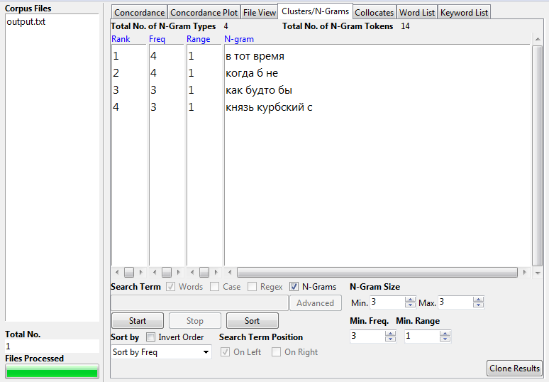
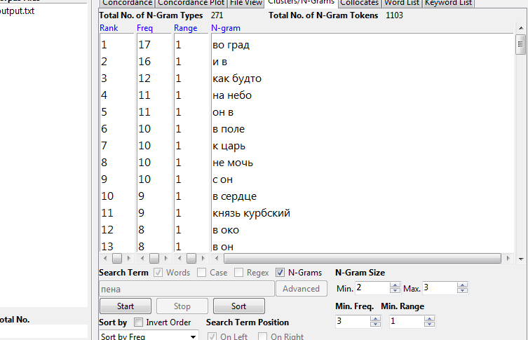
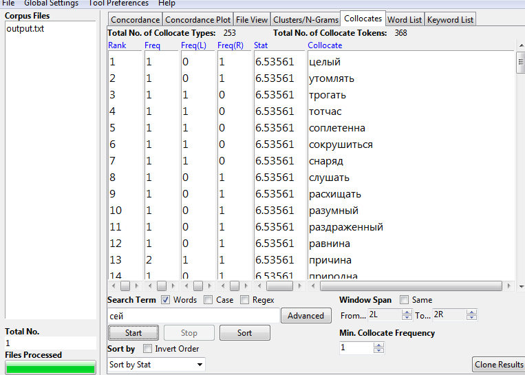
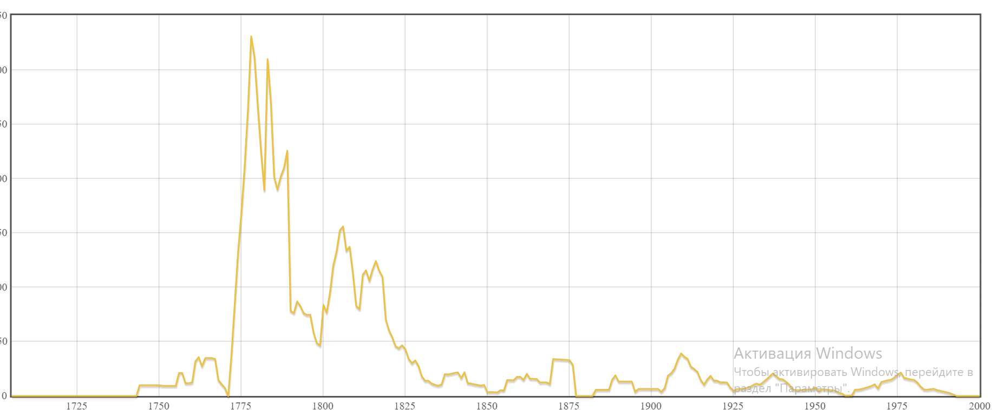
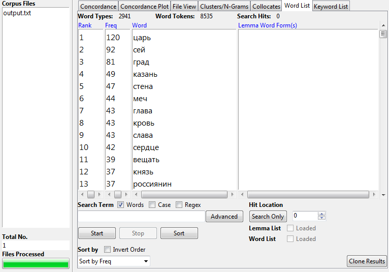

# HW3

1. 4 коркондансы

 

5 n-граммы

6 коллокаты

частотные слова

2. Тамо, ipm = 0.31

Google Ngrams: чаще употребляется в середине предложения перед предлогами, наибольшее кол-во употреблений в 1845 году
НКРЯ: практически везде употребляется в историческом или религиозном контексте, часто перед или после глаголов в середине предложения, больше всего документов приходится на 1762 год, но чаще всего употреблялось в 1803 году

Амуры, ipm = 0.055

Google Ngrams: чаще всего стоит в окружении существительных, не употебляется перед глаголами, наибольшее кол-во употреблений в 1805 году

НКРЯ: чаще всего употреблялось в художественных текстах в ряду мифологических существ или с др. существительными, больше всего документов в 1869 году, наибольшее кол-во употреблений в 1838 году

Чертоги, ipm = 1.13

Google Ngrams: чаще всего употребляется с местоимениями или существительными, наибольшее кол-во употреблений в 1809 году

НКРЯ: чаще всего употребляется с прилагательными или существительными, больше всего документов в 1841 году, наибольшее кол-во употреблений в 1811 году

Щеголиха, ipm = 1.67

Google Ngrams: в 1814-1815 годах кол-во употреблений наибольшее и примерно одинаково, с начала 20 века кол-во употреблений резко снижается, часто встречается со словом "вскипела"

НКРЯ: часто встречается вместе со словом "модница", больше всего документов в 1789 году, наибольее кол-во употреблений в 1805 году, кол-во употреблений резко снижатся с конца 19 века

Далече, ipm = 1.67

Google Ngrams: часто употребляется со словом "чисто", наибольшее кол-во употреблений в 1803 году

НКРЯ: часто употребляется со служебными частями речи, глаголами или в самом конце преложения, больше всего документов в 2003 году, наибольшее кол-во употрелений в 1844 году

3. Корпус особенно полезен для изучения иностранных языков или просто поиска редких форм и конструкций, удобен для поиска стихотворений определенного отрезка времени с повторяющимися мотивами. 
